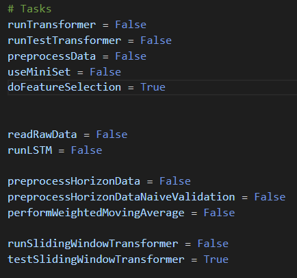
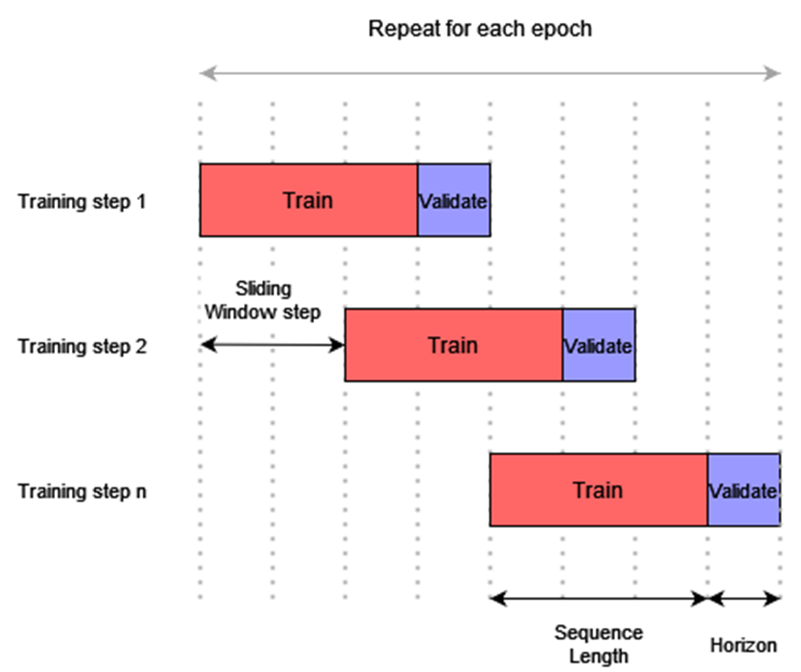
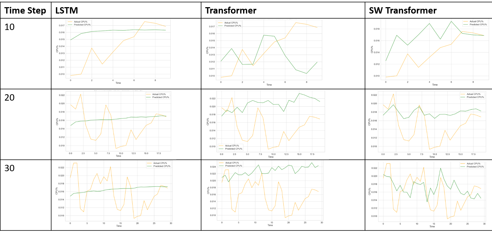

# Transformer for Cloud Workload Forecasting

## Technologies uses:

-   Python
-   Pytorch

## Problem

Cloud computing is costly, and improper resource allocation can lead to:

-   **Underprovisioning**, which degrades performance and affects Quality of Service (QoS)
-   **Overprovisioning**, which results in unnecessary expenses

Accurate **cloud workload forecasting** is therefore critical for maintaining cost efficiency and service reliability.

---

## Proposed Solution: Multivariate Transformer with Sliding Window Validation

This approach builds upon the architecture presented in the **Zerveas et al.** paper and introduces enhancements tailored for cloud workload prediction.

### Key Features:

-   **Improved handling of long-term dependencies** compared to traditional models
-   **Faster training time**
-   **Customizable** via hyperparameters such as the number of layers and encoder blocks
-   **Encoder-only architecture**, as decoders are primarily useful in sequence generation tasks like NLP

---

## Architecture Overview

The workflow includes **data preprocessing**, and outputs two model variations:

1. **Standard Transformer** – based on the original implementation
2. **Sliding Window Transformer** – an enhanced version using a sliding window mechanism for time-series segmentation

---

## How to run:

-   mvts_transformer contains mainly existing code from the Transformer model
-   transformerSlidingWindow contains code for the sliding window transformer which also does some preprocessing.
-   RunModels contains the data preprocessing and all the architecture.
    Run
    Run `RunModels.py` which will start the whole application.
-   There are hyperparameters that can be finetuned
-   There is a list of tasks that can be turned on and off as boolean flags which determine what operations and what models get run.

    

## Sliding Window Transformer

This variant uses a sliding window approach to efficiently model temporal patterns in multivariate time series data.

---

## Results

The modified Transformer demonstrates improved forecasting accuracy and efficiency.

